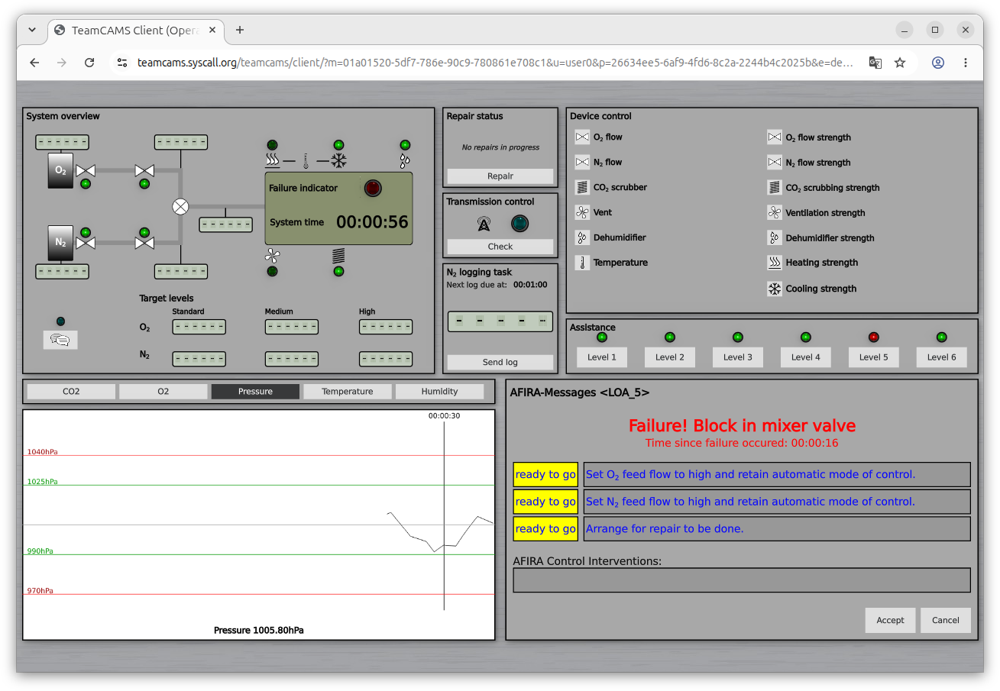
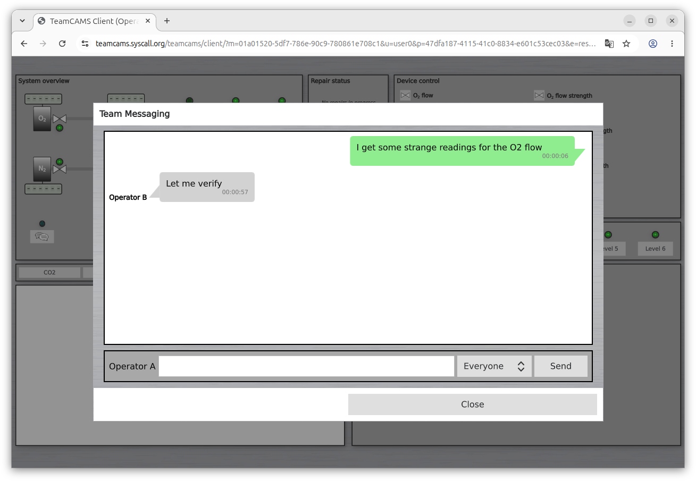
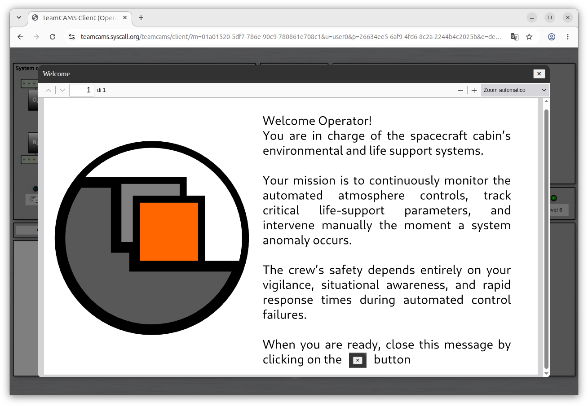

# TeamCAMS Operator Interface
The TeamCAMS Operator Interface is the participant-facing component of the TeamCAMS research platform.

As part of the latest generation of TeamCAMS, which evolved from the AutoCAMS 2.0 research environment, the Operator Interface provides access to experimental sessions through a web browser. Participants can monitor and control the simulated environment, collaborate with team members, communicate through integrated messaging tools, complete training activities, and respond to experimental events in real time.

Unlike the Experiment Manager and Script Editor, the Operator Interface requires no local installation. Participants simply connect to an experiment using a link provided by the researcher, making TeamCAMS suitable for both laboratory-based and distributed online studies.

## Features

- Fully web-based interface.
- No installation required for participants.
- Real-time connection to TeamCAMS experimental sessions.
- Support for individual and team-based experiments.
- Monitoring and control of the simulated environment.
- Integrated messaging system.
- Interactive training and tutorial support.
- Compatible with desktop and mobile devices.
- Real-time communication with researchers and other participants.
- Automatic collection of participant actions and performance data.

## Purpose

The Operator Interface is designed for study participants taking part in TeamCAMS experiments.

Through the interface, participants can:

- Monitor the state of the simulated system.
- Respond to alarms and events.
- Diagnose and manage system faults.
- Complete primary and secondary experimental tasks.
- Communicate with team members.
- Receive instructions from the researcher.
- Follow integrated tutorials and training sessions.
- Collaborate in distributed teamwork experiments.

## How It Fits Into TeamCAMS

The TeamCAMS ecosystem consists of four main components:

### Script Editor

Used by researchers to create and edit experimental scenarios.

Repository:

https://github.com/slashdotted/TeamCAMS-ScriptEditor

### Experiment Manager

Used by researchers to configure and run experimental sessions.

Repository:

https://github.com/slashdotted/TeamCAMS-Manager

### Operator Interface

This application.

Used by participants to take part in experimental sessions through a web browser.

### Log Processor

Used after data collection to process and extract information from TeamCAMS log files.

Repository:

https://github.com/slashdotted/TeamCAMS-LogProcessor

## Typical Workflow

1. The researcher launches TeamCAMS Experiment Manager on a local computer.
2. An experimental script or scenario is selected.
3. Participant accounts and operator access permissions are configured.
4. The experiment is started from the manager.
5. A participation link is shared with external participants.
6. Participants join through the web-based operator interface without installing any software.
7. Experimental data and event logs are automatically collected during the session.
8. The generated log files are processed using the Log Processor.
9. Extracted datasets are imported into statistical or data analysis software.

## Screenshots

### Main Interface

The primary workspace used by participants to monitor system status, control subsystems, respond to events, and perform experimental tasks.

### Team Messaging

Integrated communication tools allow participants to exchange messages, coordinate activities, and collaborate during distributed experiments. The same system can also be used by researchers or automated agents to deliver instructions, guidance, or experimental manipulations.

### Training and Tutorials

User defined tutorials help participants learn the interface and understand experimental procedures before the beginning of a session. Researchers can use training activities to reduce onboarding time and improve consistency across participants.

## Team-Based Research

The current generation of TeamCAMS was specifically designed to support distributed teamwork research.

Multiple participants can simultaneously interact with the same simulation through independent interfaces. Different roles, permissions, and information views can be assigned to team members, enabling the study of communication, coordination, leadership, decision-making, and human-AI teaming in controlled experimental settings.

## Research Applications

TeamCAMS has been used for research in areas including:

- Human-AI interaction
- Human-automation collaboration
- Adaptive automation
- Team performance
- Distributed teamwork
- Decision making
- Situation awareness
- Cognitive workload
- Human factors and ergonomics
- Applied psychology

## Research Background

TeamCAMS (Team Cabin Air Management System) is a research platform for studying human behavior in complex socio-technical environments. The current version extends previous generations of CAMS by supporting collaborative work, online participation, integrated communication tools, and modern client-server experimentation.

The current TeamCAMS platform has been developed since 2015 by **Amos Brocco** as part of a collaboration between:

- Cognitive Ergonomics and Work Psychology Team, Department of Psychology, University of Fribourg, Switzerland
- Department of Innovative Technologies, University of Applied Sciences and Arts of Southern Switzerland (SUPSI)

## Supported Platforms

The Operator Interface is web-based and can be accessed through modern web browsers on:

- Windows
- Linux
- macOS
- Android
- iOS

No software installation is required.

## License

TeamCAMS Experiment Manager is released under the terms of the GNU General Public License v3.0 (GPL-3.0).

See the `LICENSE.txt` file for details.

## Citation

If you use TeamCAMS in scientific work, please cite the corresponding TeamCAMS publication once available.

## Contacts

**Software development and project information**  
Amos Brocco  
Department of Innovative Technologies (SUPSI)  
Email: amos.brocco [at] supsi [dot] ch

**Scientific inquiries, research use, and collaborations**  
Cognitive Ergonomics and Work Psychology Team  
Department of Psychology, University of Fribourg, Switzerland  
https://www.unifr.ch/psycho/en/department/staff/teams/cogerg.html
